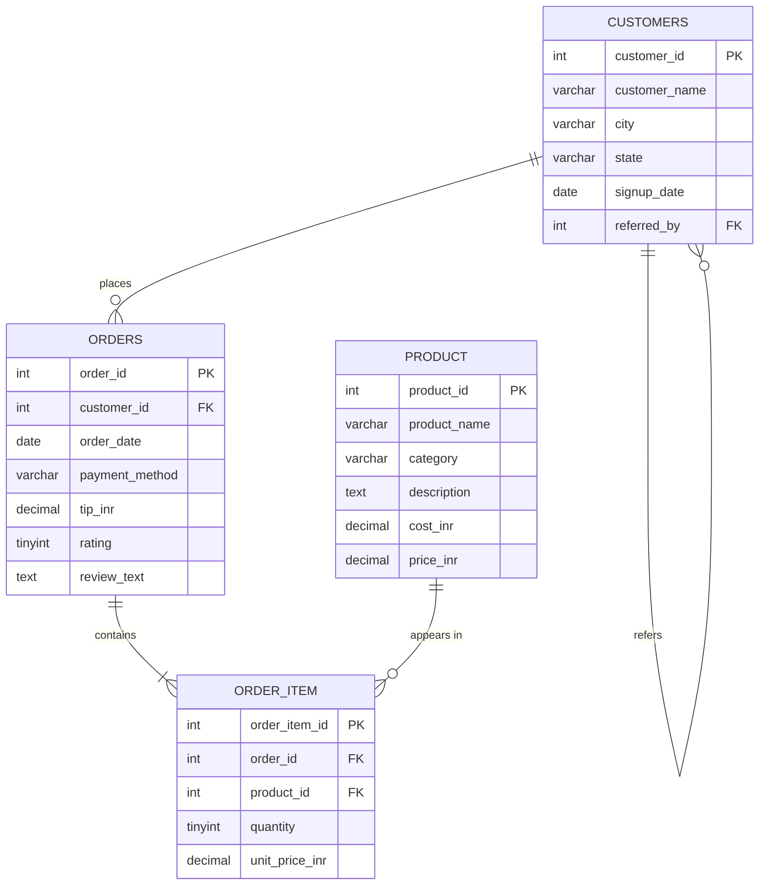

# ER Diagram

```mermaid
erDiagram
    CUSTOMERS ||--o{ ORDERS : places
    CUSTOMERS ||--o{ CUSTOMERS : refers
    ORDERS ||--|{ ORDER_ITEM : contains
    PRODUCT ||--o{ ORDER_ITEM : "appears in"

    CUSTOMERS {
        int customer_id PK
        varchar customer_name
        varchar city
        varchar state
        date signup_date
        int referred_by FK
    }
    PRODUCT {
        int product_id PK
        varchar product_name
        varchar category
        text description
        decimal cost_inr
        decimal price_inr
    }
    ORDERS {
        int order_id PK
        int customer_id FK
        date order_date
        varchar payment_method
        decimal tip_inr
        tinyint rating
        text review_text
    }
    ORDER_ITEM {
        int order_item_id PK
        int order_id FK
        int product_id FK
        tinyint quantity
        decimal unit_price_inr
    }
```

GitHub renders this automatically. For a PNG for `images/`, screenshot it on GitHub, or use MySQL Workbench: Database > Reverse Engineer.
